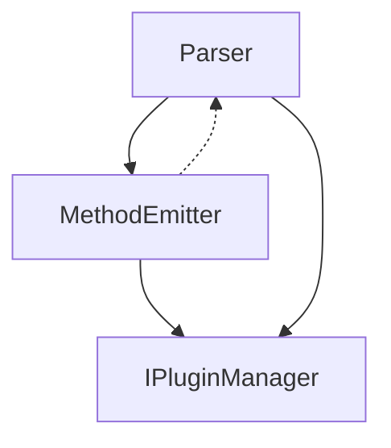
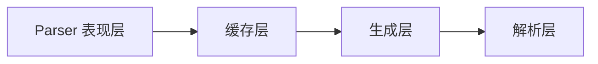
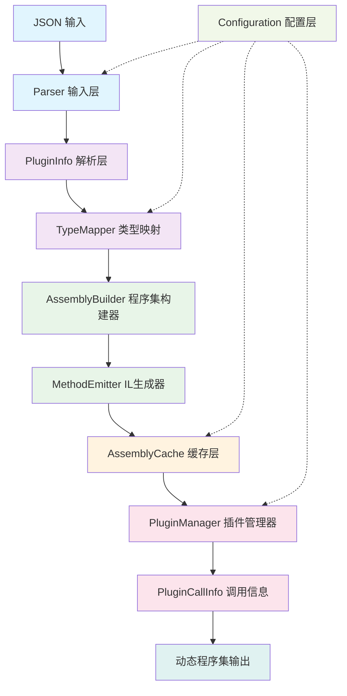
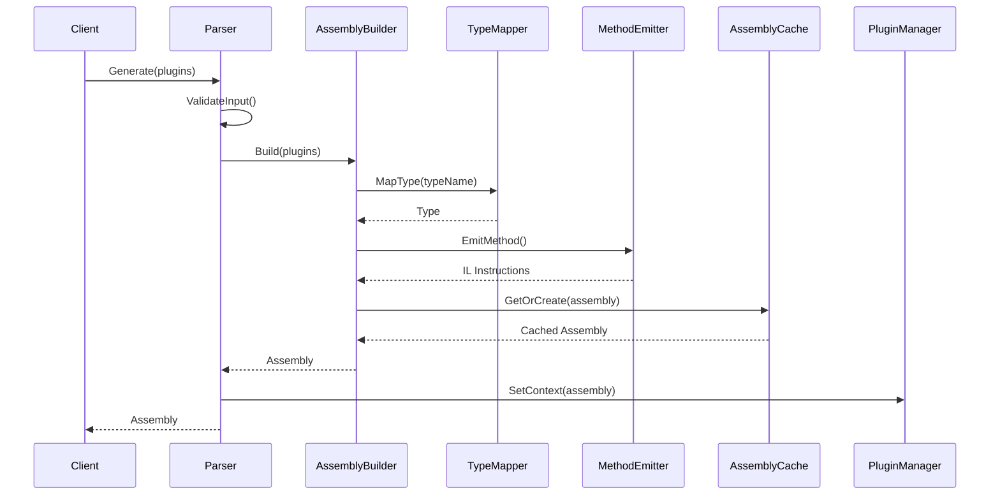
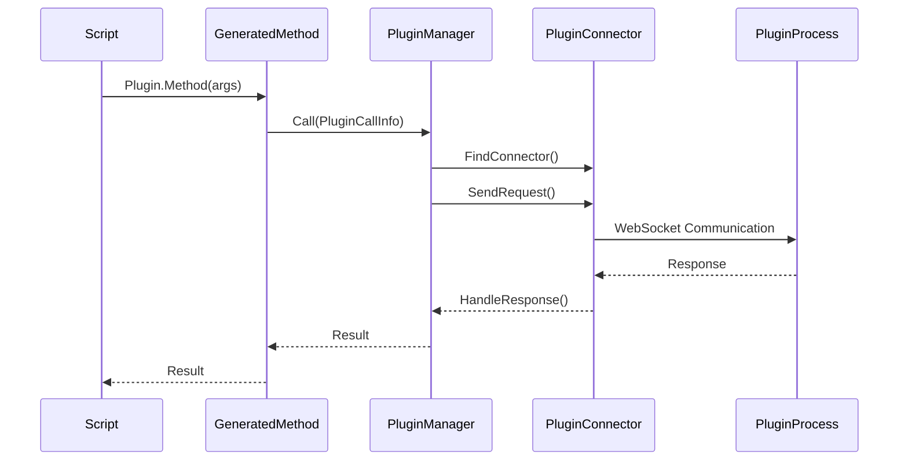

# KitX.CSharp.Parser 架构分析与重构建议

## 🚨 当前架构问题分析

### 1. 循环依赖风险



**问题描述：**
- [`Parser`](KitX Standard/KitX Script/Kscript.CSharp.Parser/Parser.cs:12) 设置插件管理器，但 [`MethodEmitter`](KitX Standard/KitX Script/Kscript.CSharp.Parser/CodeGen/MethodEmitter.cs:10) 也需要访问
- [`MethodEmitter.SetStaticPluginManager()`](KitX Standard/KitX Script/Kscript.CSharp.Parser/CodeGen/MethodEmitter.cs:21) 创建了隐式依赖

### 2. 职责边界模糊

| 类 | 当前职责 | 问题 |
|------|----------|------|
| **Parser** | 入口+配置+协调+缓存管理 | 职责过多，违反单一职责原则 |
| **MethodEmitter** | IL生成+插件管理器管理 | 混合了生成逻辑和运行时逻辑 |
| **AssemblyCache** | 缓存+直接调用MethodEmitter | 缓存层不应该知道生成细节 |

### 3. 跨层调用问题



**问题：** 缓存层直接调用生成层，破坏了分层架构的纯粹性

## 🎯 重构方案：单向数据流架构

### 核心设计原则

1. **数据只能向下流动**：上层 → 下层
2. **配置只能横向注入**：配置层 → 各层
3. **事件只能向上冒泡**：下层 → 上层（异常、状态）
4. **禁止跨层调用**：只能调用相邻层

### 📋 重构后的分层架构



### 🔧 重构后的类职责

| 层级 | 类名 | 职责 | 输入 | 输出 |
|------|------|------|------|------|
| **输入层** | Parser | 统一入口，参数验证 | JSON/PluginInfo | 验证后的数据 |
| **解析层** | TypeMapper | 类型映射，验证 | 类型字符串 | System.Type |
| **生成层** | AssemblyBuilder | 协调生成过程 | PluginInfo | IL代码 |
| | MethodEmitter | 纯IL生成 | 类型信息 | IL指令 |
| **缓存层** | AssemblyCache | 纯缓存管理 | 程序集 | 缓存的程序集 |
| **执行层** | PluginManager | 插件调用 | 调用信息 | 执行结果 |
| **配置层** | Configuration | 配置管理 | 配置数据 | 配置实例 |

## 🛠️ 具体重构策略

### 1. 引入依赖注入容器

```csharp
// 替代静态依赖
public class ServiceContainer
{
    public void ConfigureServices()
    {
        services.AddSingleton<IPluginManager, RealPluginManager>();
        services.AddSingleton<ITypeMapper, TypeMapper>();
        services.AddSingleton<IAssemblyCache, AssemblyCache>();
        services.AddSingleton<IAssemblyBuilder, AssemblyBuilder>();
        services.AddSingleton<IMethodEmitter, MethodEmitter>();
    }
}
```

### 2. 接口隔离原则

```csharp
// 明确的接口定义
public interface IAssemblyBuilder
{
    Assembly BuildFromPlugins(List<PluginInfo> plugins, string assemblyName);
}

public interface IMethodEmitter
{
    void EmitMethod(TypeBuilder typeBuilder, Function function);
}

public interface ITypeMapper
{
    Type MapType(string typeName);
    void RegisterCustomType(string typeName, Type type);
}
```

### 3. 事件驱动通信

```csharp
// 替代直接调用
public class AssemblyBuilder
{
    public event EventHandler<AssemblyGeneratedEventArgs> AssemblyGenerated;
    public event EventHandler<MethodGeneratedEventArgs> MethodGenerated;

    public Assembly Build(List<PluginInfo> plugins)
    {
        // 生成逻辑
        foreach (var plugin in plugins)
        {
            foreach (var function in plugin.Functions)
            {
                MethodGenerated?.Invoke(this, new MethodGeneratedEventArgs(function));
            }
        }

        var assembly = // ... 生成程序集
        AssemblyGenerated?.Invoke(this, new AssemblyGeneratedEventArgs(assembly));
        return assembly;
    }
}
```

### 4. 配置管理分离

```csharp
public class ParserConfiguration
{
    public IPluginManager PluginManager { get; set; }
    public bool UseCache { get; set; } = true;
    public string DefaultAssemblyName { get; set; } = "DynamicPluginAssembly";
    public TimeSpan CacheTimeout { get; set; } = TimeSpan.FromHours(1);
}

public class ConfigurationManager
{
    public static ParserConfiguration GetConfiguration()
    {
        // 从配置文件、环境变量等读取配置
        return new ParserConfiguration
        {
            UseCache = bool.Parse(Environment.GetEnvironmentVariable("KSCRIPT_CACHE") ?? "true"),
            DefaultAssemblyName = Environment.GetEnvironmentVariable("KSCRIPT_ASSEMBLY_NAME") ?? "DynamicPluginAssembly"
        };
    }
}
```

## 🔄 重构后的数据流

### 程序集生成流程



### 插件调用流程



## ✅ 重构收益

1. **清晰的职责分离** - 每个类只负责一个明确的功能
2. **单向数据流** - 避免循环依赖和混乱的调用关系
3. **易于测试** - 每层可以独立测试
4. **易于维护** - 修改一层不会影响其他层
5. **可扩展性** - 新功能可以通过添加新层实现
6. **配置灵活性** - 通过依赖注入支持不同的运行环境

## 🎯 实施步骤

1. **第一阶段：接口定义**
   - 定义各层的接口
   - 确定数据契约

2. **第二阶段：依赖注入**
   - 引入DI容器
   - 重构静态依赖

3. **第三阶段：事件驱动**
   - 替换直接调用为事件
   - 实现观察者模式

4. **第四阶段：配置管理**
   - 分离配置逻辑
   - 支持多环境配置

5. **第五阶段：测试验证**
   - 单元测试各层
   - 集成测试整体流程

这样的重构将显著提升 KitX.CSharp.Parser 项目的可维护性和可扩展性，同时保持现有功能的完整性。
