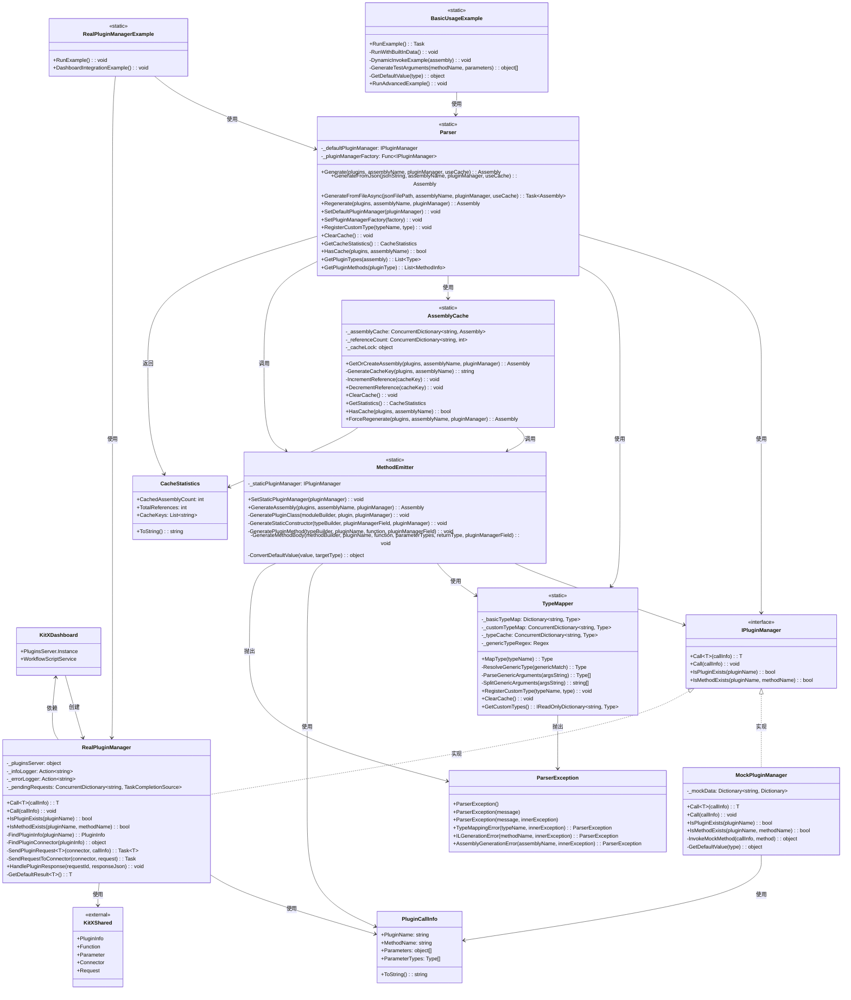
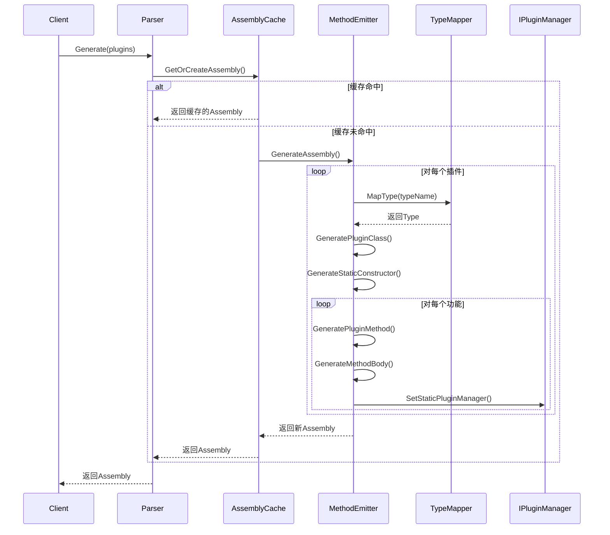
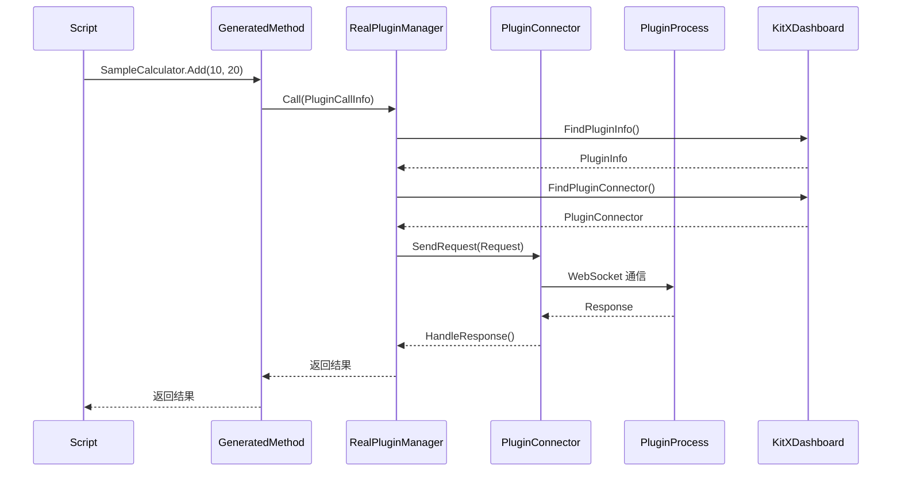

# KitX.CSharp.Parser 类图与调用关系

## 📊 整体架构类图



## 🔄 调用时序图

### 基本生成流程



### 真实插件调用流程



## 📋 类职责说明

### 核心类

| 类名 | 职责 | 关键方法 |
|------|------|----------|
| **Parser** | 主入口，统一API | `Generate()`, `GenerateFromJson()`, `GenerateFromFileAsync()` |
| **IPluginManager** | 插件管理器接口 | `Call<T>()`, `IsPluginExists()` |
| **MockPluginManager** | 模拟插件管理器 | `Call<T>()`, `InvokeMockMethod()` |
| **RealPluginManager** | 真实插件管理器 | `Call<T>()`, `SendPluginRequest<T>()` |

### 代码生成类

| 类名 | 职责 | 关键方法 |
|------|------|----------|
| **MethodEmitter** | IL代码生成 | `GenerateAssembly()`, `GeneratePluginClass()` |
| **TypeMapper** | 类型映射 | `MapType()`, `RegisterCustomType()` |
| **AssemblyCache** | 程序集缓存 | `GetOrCreateAssembly()`, `ForceRegenerate()` |

### 数据模型类

| 类名 | 职责 | 关键属性 |
|------|------|----------|
| **PluginCallInfo** | 插件调用信息 | `PluginName`, `MethodName`, `Parameters` |
| **CacheStatistics** | 缓存统计信息 | `CachedAssemblyCount`, `TotalReferences` |

## 🔧 设计模式应用

### 1. 工厂模式
- `Parser.SetPluginManagerFactory()` - 创建插件管理器实例
- `MethodEmitter.GenerateAssembly()` - 创建动态程序集

### 2. 策略模式
- `IPluginManager` 接口 - 不同的插件管理器实现策略
- `MockPluginManager` vs `RealPluginManager` - 测试vs生产策略

### 3. 单例模式
- `AssemblyCache` - 静态缓存管理
- `TypeMapper` - 静态类型映射

### 4. 建造者模式
- `MethodEmitter` 中的 IL 生成过程
- `Connector` 的请求构建过程

### 5. 模板方法模式
- `Parser.Generate()` 方法的通用流程
- 插件方法生成的标准流程

## 🎯 关键调用路径

### 1. 程序集生成路径
```
Parser.Generate()
→ AssemblyCache.GetOrCreateAssembly()
→ MethodEmitter.GenerateAssembly()
→ TypeMapper.MapType()
→ IL生成
```

### 2. 插件调用路径
```
生成的静态方法
→ IPluginManager.Call()
→ RealPluginManager.SendPluginRequest()
→ WebSocket通信
→ 插件进程
```

### 3. 缓存管理路径
```
AssemblyCache.GenerateCacheKey()
→ SHA256哈希计算
→ 缓存查找/存储
→ 引用计数管理
```

这个类图展示了 KitX.CSharp.Parser 项目的完整架构，包括各个类之间的依赖关系、调用顺序和设计模式的应用。
