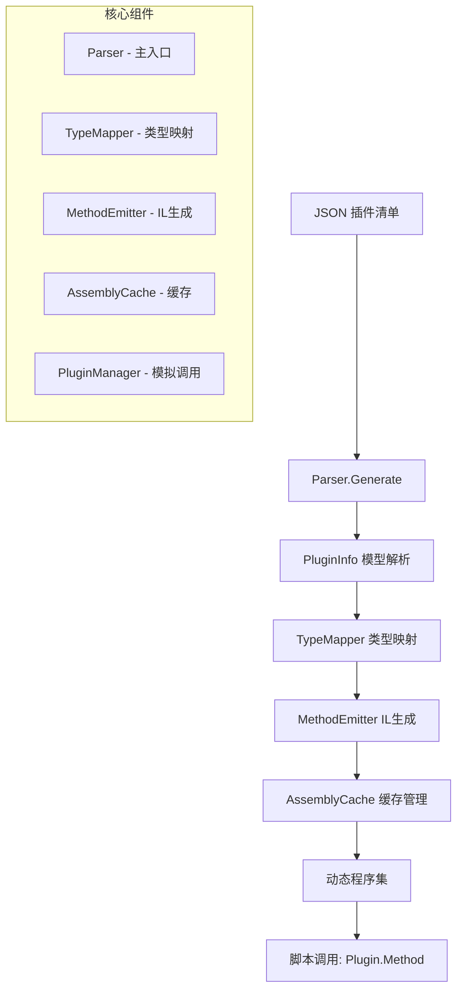

现在让我为你详细规划 KitX.CSharp.Parser 项目的架构和实现方案：

## 🏗️ 项目架构概览



## 📁 详细目录结构

```
KitX.CSharp.Parser/
├─ src/
│   ├─ Parser.cs                    # 主入口静态类
│   ├─ Models/
│   │   ├─ PluginInfo.cs           # 插件信息模型
│   │   ├─ FunctionInfo.cs         # 功能信息模型
│   │   ├─ ParameterInfo.cs        # 参数信息模型
│   │   └─ PluginCallInfo.cs       # 插件调用信息
│   ├─ CodeGen/
│   │   ├─ TypeMapper.cs           # 字符串到Type的映射
│   │   ├─ MethodEmitter.cs        # IL方法生成器
│   │   └─ AssemblyCache.cs        # 程序集缓存管理
│   ├─ Core/
│   │   ├─ IPluginManager.cs       # 插件管理器接口
│   │   └─ MockPluginManager.cs    # 模拟实现
│   └─ Exceptions/
│       └─ ParserException.cs      # 自定义异常
├─ examples/
│   └─ ConsoleDemo/                # 演示程序
├─ KitX.CSharp.Parser.csproj      # 项目文件
└─ GlobalUsings.cs                 # 全局using声明
```

## 🔧 核心技术要点

1. **类型映射策略**：
   - 基础类型：`int` → `System.Int32`
   - 泛型类型：`List<int>` → `List<System.Int32>`
   - 自定义类型回退机制

2. **IL 生成模式**：
   ```csharp
   // 生成的方法体伪代码
   public static T MethodName(params...)
   {
       var callInfo = new PluginCallInfo(pluginName, methodName, parameters);
       return PluginManager.Call<T>(callInfo);
   }
   ```

3. **缓存机制**：
   - 按插件清单 Hash 缓存程序集
   - 支持热更新时的缓存失效

## 🎯 关键实现亮点

- **类型安全**：编译时类型检查，运行时类型转换
- **性能优化**：程序集缓存避免重复生成
- **扩展性**：支持自定义类型映射注册
- **调试友好**：可选的磁盘程序集输出
