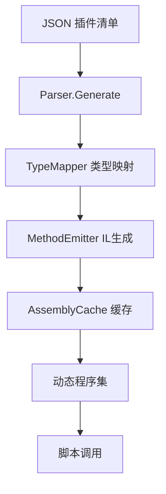

# KitX.CSharp.Parser 使用指南

## 📖 概述

KitX.CSharp.Parser 是 KitX 工作流子系统的核心组件，它能够将插件清单 JSON 即时编译成可直接调用的 C# 静态 API。通过动态 IL 生成技术，让脚本引擎可以像调用普通静态方法一样使用插件功能。

## 🚀 快速开始

### 基本用法

```csharp
using Kscript.CSharp.Parser;

// 1. 从 JSON 字符串生成程序集
var jsonString = File.ReadAllText("plugins.json");
var assembly = Parser.GenerateFromJson(jsonString);

// 2. 从文件生成程序集
var assembly = await Parser.GenerateFromFileAsync("plugins.json");

// 3. 从插件信息列表生成程序集
var plugins = new List<PluginInfo> { /* ... */ };
var assembly = Parser.Generate(plugins);
```

### 动态调用生成的方法

```csharp
// 获取生成的插件类型
var pluginTypes = Parser.GetPluginTypes(assembly);

foreach (var type in pluginTypes)
{
    var methods = Parser.GetPluginMethods(type);
    foreach (var method in methods)
    {
        // 动态调用方法
        var result = method.Invoke(null, new object[] { /* 参数 */ });
        Console.WriteLine($"结果: {result}");
    }
}
```

## 🔧 API 参考

### Parser 静态类

主入口类，提供所有核心功能。

#### 生成方法

| 方法 | 描述 | 参数 |
|------|------|------|
| `Generate()` | 从插件信息列表生成程序集 | `plugins`, `assemblyName`, `pluginManager`, `useCache` |
| `GenerateFromJson()` | 从 JSON 字符串生成程序集 | `jsonString`, `assemblyName`, `pluginManager`, `useCache` |
| `GenerateFromFileAsync()` | 从 JSON 文件异步生成程序集 | `jsonFilePath`, `assemblyName`, `pluginManager`, `useCache` |
| `Regenerate()` | 强制重新生成程序集（绕过缓存） | `plugins`, `assemblyName`, `pluginManager` |

#### 配置方法

| 方法 | 描述 |
|------|------|
| `SetDefaultPluginManager()` | 设置默认插件管理器 |
| `RegisterCustomType()` | 注册自定义类型映射 |
| `ClearCache()` | 清除所有缓存 |

#### 分析方法

| 方法 | 描述 |
|------|------|
| `GetPluginTypes()` | 获取程序集中的插件类型 |
| `GetPluginMethods()` | 获取插件类型的方法信息 |
| `GetCacheStatistics()` | 获取缓存统计信息 |
| `HasCache()` | 检查是否存在缓存 |

### 类型映射系统

#### 支持的基础类型

| JSON 字符串 | CLR 类型 |
|-------------|----------|
| `"void"` | `System.Void` |
| `"bool"` | `System.Boolean` |
| `"int"` | `System.Int32` |
| `"double"` | `System.Double` |
| `"string"` | `System.String` |
| `"object"` | `System.Object` |

#### 泛型类型支持

```csharp
// 支持的泛型类型
"List<int>"           → List<int>
"Dictionary<string,int>" → Dictionary<string, int>
"Nullable<int>"       → int?
"Array<string>"       → string[]
```

#### 自定义类型映射

```csharp
// 注册自定义类型
Parser.RegisterCustomType("DateTime", typeof(DateTime));
Parser.RegisterCustomType("MyCustomType", typeof(MyClass));
```

## 🏗️ 架构设计

### 核心组件

1. **Parser** - 主入口类，统一API接口
2. **TypeMapper** - 类型映射器，处理字符串到Type的转换
3. **MethodEmitter** - IL方法生成器，核心IL生成逻辑
4. **AssemblyCache** - 程序集缓存，提升性能
5. **PluginManager** - 插件管理器接口，处理实际调用

### 工作流程



## 📝 插件清单格式

### 基本结构

```json
[
  {
    "Name": "PluginName",
    "Version": "1.0.0",
    "Functions": [
      {
        "Name": "MethodName",
        "ReturnValueType": "int",
        "Parameters": [
          {
            "Name": "paramName",
            "Type": "string",
            "IsOptional": false,
            "Value": "defaultValue"
          }
        ]
      }
    ]
  }
]
```

### 完整示例

参考项目根目录的 `example.json` 文件，包含完整的插件定义示例。

## ⚡ 性能优化

### 缓存机制

- **程序集缓存**: 相同插件清单只生成一次
- **类型映射缓存**: 避免重复类型解析
- **智能哈希**: 基于插件内容生成缓存键

### 最佳实践

```csharp
// 1. 复用程序集
var assembly = Parser.Generate(plugins, useCache: true);

// 2. 批量注册自定义类型
Parser.RegisterCustomType("DateTime", typeof(DateTime));
Parser.RegisterCustomType("Guid", typeof(Guid));

// 3. 合理使用强制重新生成
if (pluginChanged)
{
    assembly = Parser.Regenerate(plugins);
}
```

## 🔍 调试功能

### 日志输出

使用 `MockPluginManager` 时会输出详细的调用日志：

```
[MockPluginManager] 调用插件方法: SampleCalculator.Add(10, 20)
[MockPluginManager] 参数类型: [Int32, Int32]
[MockPluginManager] 期望返回类型: Int32
[MockPluginManager] 返回结果: 30
```

### 缓存统计

```csharp
var stats = Parser.GetCacheStatistics();
Console.WriteLine($"缓存统计: {stats.CachedAssemblyCount} 个程序集");
```

## 🚨 错误处理

### 异常类型

- `ParserException` - 解析器相关异常
- `ArgumentException` - 参数错误
- `FileNotFoundException` - 文件不存在

### 异常处理示例

```csharp
try
{
    var assembly = Parser.GenerateFromJson(jsonString);
}
catch (ParserException ex)
{
    Console.WriteLine($"解析失败: {ex.Message}");
}
catch (JsonException ex)
{
    Console.WriteLine($"JSON 格式错误: {ex.Message}");
}
```

## 🔌 扩展点

### 自定义插件管理器

```csharp
public class CustomPluginManager : IPluginManager
{
    public T Call<T>(PluginCallInfo callInfo)
    {
        // 实现自定义调用逻辑
        return default(T);
    }

    // 实现其他接口方法...
}

// 设置自定义管理器
Parser.SetDefaultPluginManager(new CustomPluginManager());
```

### 自定义类型映射

```csharp
// 扩展类型映射
TypeMapper.RegisterCustomType("Vector3", typeof(UnityEngine.Vector3));
TypeMapper.RegisterCustomType("Color", typeof(System.Drawing.Color));
```

## 🔄 与其他系统集成

### 脚本引擎集成

生成的程序集可直接用于各种 C# 脚本引擎：

- **Roslyn** - Microsoft.CodeAnalysis
- **CSharpScript** - Microsoft.CodeAnalysis.CSharp.Scripting
- **CS-Script** - 第三方脚本引擎

### 示例集成代码

```csharp
// 在脚本中使用生成的API
var script = @"
    int result = SampleCalculator.Add(10, 20);
    string reversed = StringToolkit.Reverse(""Hello"");
    return result;
";

// 通过脚本引擎执行
var assembly = Parser.Generate(plugins);
var scriptResult = ExecuteScript(script, assembly);
```

## 📚 更多示例

完整的使用示例请参考：
- `Examples/BasicUsageExample.cs` - 基础功能演示
- `Examples/Program.cs` - 控制台演示程序

## 🔗 相关项目

- **KitX.Shared.CSharp** - 共享数据模型
- **KitX 主项目** - 完整的插件生态系统
